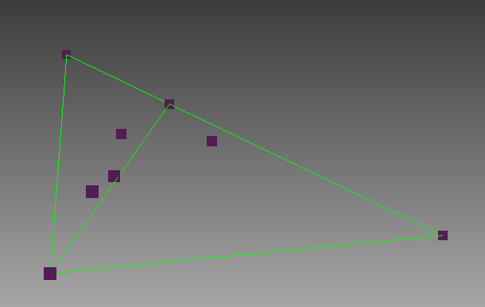

# Convex Hull
2D and 3D convex hull algorithm implemented by c++
# Result
## 2D convex polygon

## 3D convex hull
### classic 3D model

### shpere point cloud

### plane point cloud

### duplicate point cloud

# Reference
https://github.com/swapnil96/Convex-hull
